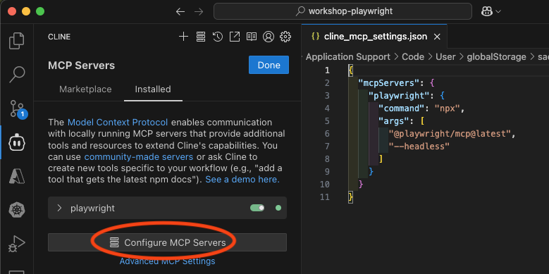

# workshop-playwright

- [Playwright for Python > Getting Started](https://playwright.dev/python/docs/intro)
- [Playwright Trace Viewer](https://trace.playwright.dev/)

```shell
# Install dependencies
make install-deps-dev

# Run tests in verbose mode
make test-verbose

# Show traces
make show-trace

# Generate code
make codegen
```

## [Microsoft Playwright Testing](https://learn.microsoft.com/ja-jp/azure/playwright-testing/)

- [microsoft/playwright-testing-service/samples/get-started > Get Started Sample](https://github.com/microsoft/playwright-testing-service/tree/main/samples/get-started)

```shell
git clone https://github.com/microsoft/playwright-testing-service.git
cd playwright-testing-service/samples/get-started

export PLAYWRIGHT_SERVICE_URL=wss://*.api.playwright.microsoft.com/accounts/eastasia_*/browsers

# Install dependencies
npm install

# Run tests
npx playwright test --config=playwright.service.config.ts --workers=20
```

## [locust](https://docs.locust.io/en/stable/quickstart.html)

To try out Locust, run HTTP server locally and run Locust.

```shell
# Install dependencies
go install github.com/ks6088ts-labs/workshop-kubernetes@latest

# Run HTTP server
workshop-kubernetes sandbox http --port 8080
```

Run Locust and open the browser.

```shell
# Specify the failure percentage
export FLAKY_PERCENT=30

# Run locust
make locust

# Open browser to confirm that the failure percentage is almost 40% as specified above
# http://localhost:8089/
```

## [Playwright MCP server](https://github.com/microsoft/playwright-mcp)

We use Cline to generate an E2E test script using Playwright MCP server.
To do this, we need to configure Cline vscode extension to use the Playwright MCP server.

1. Install the [Cline extension](https://marketplace.visualstudio.com/items?itemName=saoudrizwan.claude-dev) for Visual Studio Code.
2. Open the Cline settings in Visual Studio Code.
3. Add the following configuration to the settings. (ref. [Running headless browser (Browser without GUI).](https://github.com/microsoft/playwright-mcp?tab=readme-ov-file#running-headless-browser-browser-without-gui))



```json
{
  "mcpServers": {
    "playwright": {
      "command": "npx",
      "args": ["@playwright/mcp@latest", "--headless"]
    }
  }
}
```

4. Open GitHub Copilot Edits and pass the following prompt.

```
Playwright's MCP server to create a Playwright test script in tests/test_hatena_bookmark.py that:
- Visits the Hatena Bookmark popular entries page (https://b.hatena.ne.jp/hotentry/all)
- Extracts the title, URL, and number of bookmark users for popular entries
- Outputs this data in JSON format to standard output
Please reference other test code implementations as needed.
```

5. Run the generated test script.

```shell
$ uv run pytest -v tests/test_hatena_bookmark.py --capture=no --verbose
tests/test_hatena_bookmark.py::test_hatena_bookmark_hotentry[chromium] [
  {
    "title": "「あんなパフォーマンスがあっていいのか」高校野球の入場行進で異例の行動　「軍隊式」に疑問を持ったチームに驚きの反響 ｜ 47NEWS",
    "url": "https://nordot.app/1276520592422387913",
    "bookmark_count": 295
  },
  {
    "title": "VSCodeでドキュメント作成するならまずこれを入れよう - Qiita",
    "url": "https://qiita.com/tossie85/items/c8aef027cb6acba3b437",
    "bookmark_count": 425
  },
  .
  .
  .
  {
    "title": "【Spice Theater＠丸の内】札幌で人気だったスパイスカレー店が店名新たに東京進出 - 御成門プログラマーのグルメ記録",
    "url": "https://food.onarimon.jp/entry/2025/03/28/213738",
    "bookmark_count": 26
  }
]
PASSED
```
